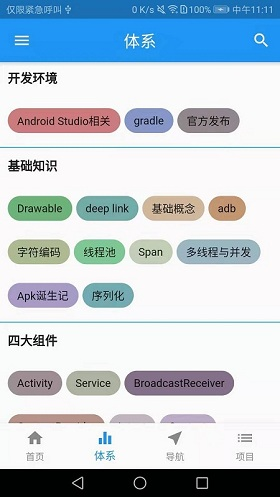
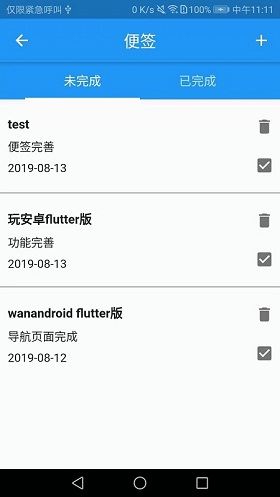

## 简介

根据鸿洋大神的WanAndroid开放api开发的一个简单的flutter版本的WanAndroid客户端







## 功能

* 登录
* 注册
* 首页banner和文章列表
* 体系
* 导航
* 项目
* 收藏
* TODO（便签）
* 搜索

## 涉及技术点

``` 
dio: 2.1.7  //网络请求库
toast: ^0.1.5  //Toast
flutter_swiper : ^1.1.6  //滚动页面，类似ViewPager
shared_preferences: ^0.5.3+4  //sp存储
flutter_webview_plugin: ^0.3.5  //webview
date_format: ^1.0.6  //日期格式化
``` 

## 学习总结

* 1.启动页默认是白屏，可在android/app/src/main/res/drawable/launch_background.xml中设置一张图片来作为闪屏页；

```
<layer-list xmlns:android="http://schemas.android.com/apk/res/android">
    <item android:drawable="@android:color/white" />

    <!-- You can insert your own image assets here -->
     <item>
        <bitmap
            android:gravity="center"
            android:src="@mipmap/splash" />
    </item>
</layer-list>
```

* 2.页面跳转，两种方式：新建路由和注册路由；

```
//新建路由
Navigator.of(context).push(MaterialPageRoute(builder: (context) {
  return WebViewPage(title, url);
}));
    
//注册路由
Navigator.pushNamed(context, '/LoginPage');
MaterialApp(//main.dart中要先注册该路由
routes: <String, WidgetBuilder>{
'/LoginPage': (context) => LoginPage(),},);
```

* 3.网络请求使用Dio库，可通过设置BaseOptions来配置基本信息，如baseUrl、超时时间等；

```
BaseOptions options = BaseOptions(
  baseUrl: API.BASE_URL,
  connectTimeout: 15000,
  maxRedirects: 3,
  receiveTimeout: 10000,
);
Dio _dio = Dio(options);
```
>如果需要在某个请求中单独设置请求头，如cookie等，可单独配置Options，Dio会自动合并BaseOptions和Options:

```
Options options = Options(headers: {'Cookie': cookies});
response = await _dio.get(url, queryParameters: params, options: options);
...
```

* 4.底部bottomNavigationBar切换时，要让页面不重绘，可将body用IndexedStack包裹；

```
body: IndexedStack(
  //防止切换底部标签界面重绘
  children: _widgets, index: _selectIndex,
),
...
```

* 5.登录界面的输入框，获取焦点时会提示超出边界，用SingleChildScrollView包裹就好；

```
child: SingleChildScrollView(
    child: Column(
  children: <Widget>[
    TextField(),
    TextField()]));
...
```

* 6.Flutter监听返回键，用WillPopScope控件的onWillPop，可在此处实现退出时候弹框提示或按两次退出；

```
return WillPopScope(
  child: Scaffold(
  ...
  ),
  onWillPop: _onBack,);
```

* 7.弹出对话框用showDialog()方法的AlertDialog，但是此控件无法通过setState更新状态，若要更新状态，可以用StatefulBuilder；

```
showDialog(
    context: context,
    builder: (context) {
      return StatefulBuilder(builder: (context, state) {
        return AlertDialog(title: Text(label),
                            content:GestureDetector(
                                  child: Text(
                                    'test',
                                  ),
                                  onTap: () {
                                      state(() {
                                        label = '哈哈';
                                      });
                                  },
                                ));});});
```

* 8.弹出日历使用showDatePicker；

```
showDatePicker(
          context: context,
          initialDate: DateTime.now(),
          firstDate: DateTime.now()
              .subtract(Duration(days: 30)),//往前30天
          lastDate:
              DateTime.now().add(Duration(days: 30)))//往后30天
      .then((dateTime) {//选定某个日期后点击确认的回调
    state(() {
      print(dateTime);
    });
    });
```

>日期格式化用date_format库：

```
//2019-08-08
formatDate(dateTime, [yyyy, '-', mm, '-', dd]);
```

>showDatePicker默认是英文的，要改成中文，需要专门设置：

```
//（1）pubspec.yaml中添加flutter_localizations
dependencies:
  flutter:
    sdk: flutter
  flutter_localizations:
    sdk: flutter
//（2）main.dart中添加如下代码
return MaterialApp(
      localizationsDelegates: [
        //日历控件设置中文需要
        GlobalMaterialLocalizations.delegate,
        GlobalWidgetsLocalizations.delegate,
      ],
      supportedLocales: [
        const Locale('zh', 'CH'),
        const Locale('en', 'US'),
      ],
      locale: const Locale('zh'),
      ...);
//（3）showDatePicker中添加locale
showDatePicker(
  locale: Locale('zh'),
  ...);
```

* 9.Webview可以使用webview_flutter或flutter_webview_plugin，但是使用过程发现用webview_flutter时，
在页面再点击其他链接时，点返回键就直接退出Webview界面而不是返回上一级，所以最后用了flutter_webview_plugin；

* 10.Json转换工具使用FlutterJsonBeanFactory插件；

* 11.打包apk命令：flutter build apk，打包后的apk在build/app/outputs/apk/release/app-release.apk目录；

* 12.ListView条目没有占满屏幕时，RefreshIndicator的下拉刷新无法触发，可以给ListView添加physics: AlwaysScrollableScrollPhysics()来解决；

```
ListView.separated(
      physics: AlwaysScrollableScrollPhysics(),
      ...)
```